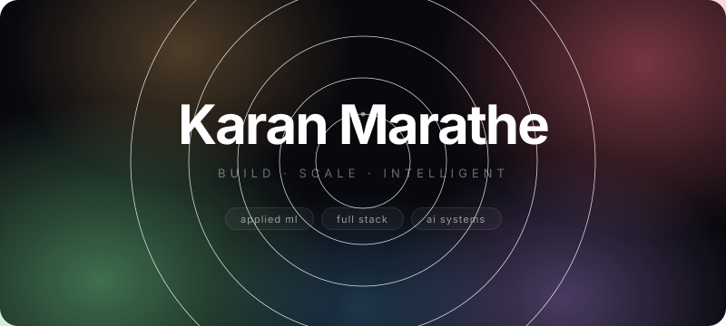

 

***

# 👨‍💻 About Me

Hi, I'm **Karan Marathe** — a passionate **Full Stack Developer** and **Applied ML Engineer** focused on building scalable, intelligent, and high-performance digital products.

I enjoy combining modern frontend engineering with powerful backend systems and AI capabilities to create production-ready applications with meaningful user experiences.

Currently exploring:

* ☁️ Cloud Computing & AWS
* ⚙️ DevOps & CI/CD
* 🔐 Cloud Security (CloudSec)
* 🤖 AI-Powered Systems
* 🧠 Scalable Backend Architecture
* 🚀 Real-Time Intelligent Applications

***

# 🚀 Featured Projects

## 🎙️ Edith — AI Voice Assistant

> Multimodal AI assistant powered by Google Gemini Live API with real-time voice, vision, gesture, and autonomous system interaction.

### ✨ Features

* 🎤 Real-time Voice Interaction
* 👁️ Vision + Gesture Recognition
* 🧠 Persistent AI Memory
* 🔐 Face ID Authentication
* ⚡ Workflow Automation
* 🚀 Sub-200ms Voice Response Latency

### 🛠️ Tech Used

`React` `TypeScript` `Gemini API` `AI Systems`

***

## 🏡 Real Estate Price Prediction System

> AI-powered machine learning system designed for scalable predictive analytics.

### ✨ Highlights

* 📈 Achieved **91% R² Accuracy**
* ⚙️ Optimized ML Pipelines
* 📊 Reduced RMSE significantly
* 🧠 Feature Engineering
* 🔄 Large-scale Synthetic Data Generation

### 🛠️ Tech Used

`Python` `Scikit-learn` `Pandas` `NumPy`

***

## 🌌 Naxshtra AI

> Modern high-performance AI website built with scalable frontend architecture and premium UI design.

### ✨ Features

* ⚡ 98/100 Lighthouse Score
* 🎨 Modern UI/UX
* 🚀 Optimized Performance
* 📱 Responsive Design
* 💎 Premium Interface

### 🛠️ Tech Used

`React` `TypeScript` `Tailwind CSS` `Vite`

🔗 https://naxshtraai.vercel.app/

***

# 💼 Experience

## 🚀 Applied ML Intern — Uplyx Solutions

* Built AI-powered predictive systems using Python
* Engineered ML pipelines with scalable architecture
* Improved model accuracy using feature engineering
* Optimized preprocessing workflows and evaluation systems

***

## 💻 Software Development Intern — NPIT

* Build responsive frontend interfaces
* Worked with Git/GitHub workflows
* Implemented CI/CD concepts
* Improved development collaboration and deployment efficiency
  

***

# 💭 Developer Philosophy

> *"Technology creates real impact when intelligence, scalability, and user experience come together."*

***

